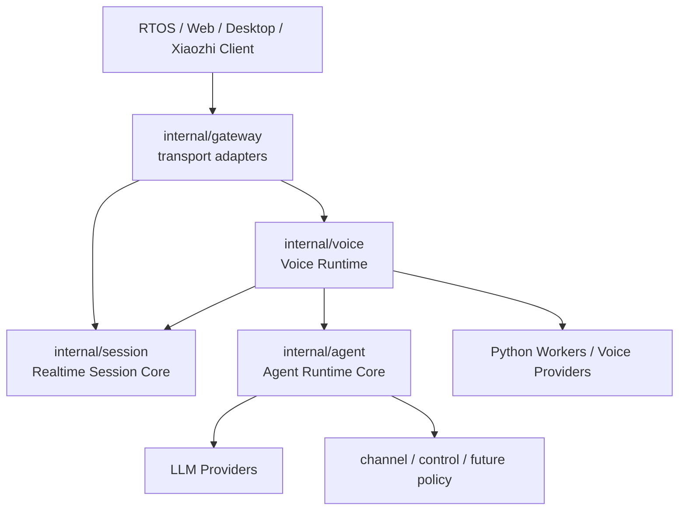
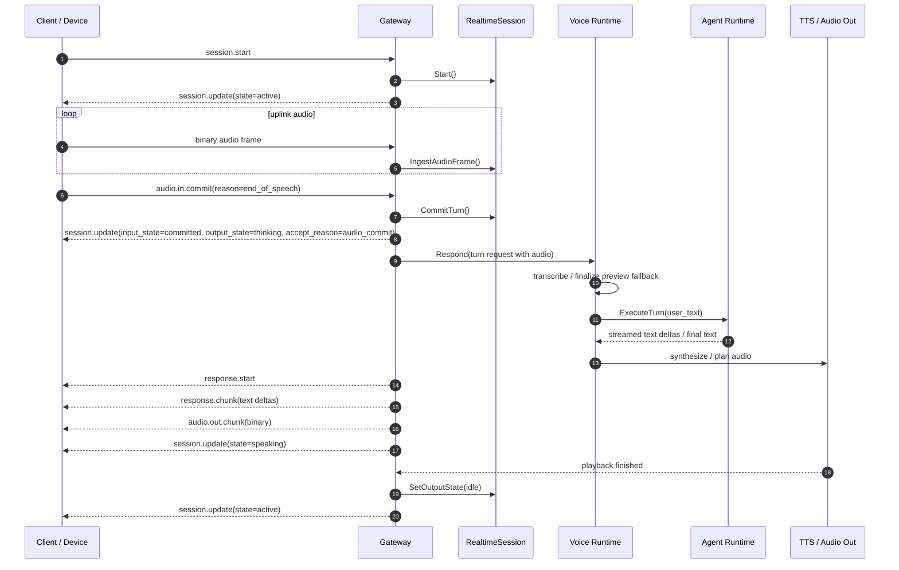
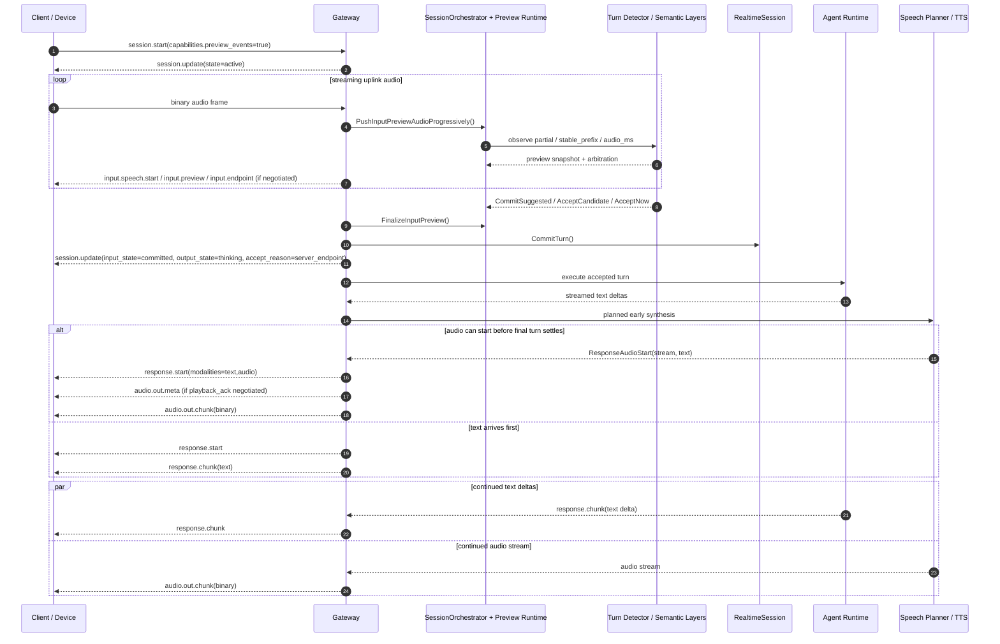
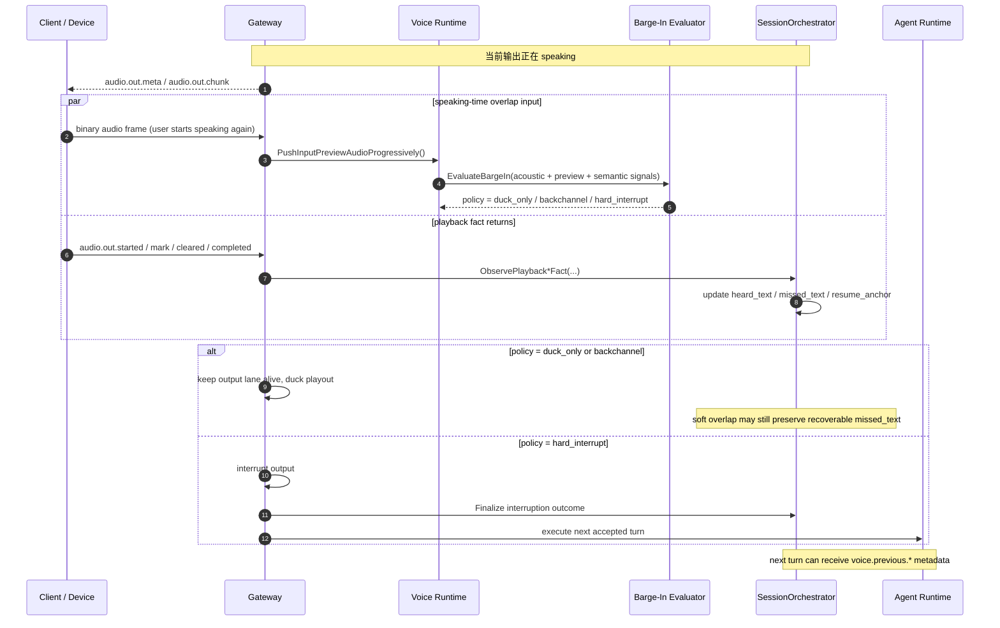

# 项目现状总览与语音流时序分析（2026-04-17）

## 文档定位

- 性质：现状盘点 / 架构状态 review / 语音链路分析
- 状态：基于当前仓库代码、协议文档、执行记录的综合分析
- 适用对象：服务端、语音算法、嵌入式 / RTOS client、后续架构演进讨论
- 相关上位文档：
  - `docs/architecture/overview.md`
  - `docs/architecture/agent-runtime-core.md`
  - `docs/architecture/voice-architecture-blueprint-zh-2026-04-16.md`
  - `docs/architecture/voice-architecture-execution-roadmap-zh-2026-04-16.md`
  - `docs/protocols/realtime-session-v0.md`
  - `docs/protocols/rtos-device-ws-v0.md`
  - `docs/protocols/realtime-voice-client-collaboration-proposal-v0-zh-2026-04-16.md`

---

## 1. 一页结论

当前项目已经不再是一个“只有 WebSocket 收发 + ASR/TTS 拼接”的 demo，而是已经形成了一条相对清晰的通用 `AI agent server` 主线：

1. **架构中心已经明确**：`Realtime Session Core` + `Agent Runtime Core` + `Voice Runtime` 是当前系统主干；设备端、Web/H5、`xiaozhi` 兼容层都被收敛为 adapter，而不是各自演化成第二套编排系统。
2. **语音能力已经明显超出基础半双工**：项目已具备 preview、server endpoint、双轨状态机、早起播、soft interruption、playback truth、resume / continue 等一整套服务侧语音编排能力。
3. **当前语音主路径是 cascade，而不是端到端 speech-to-speech**：核心链路仍是 `streaming preview ASR -> turn arbitration -> agent runtime -> streamed text -> planned TTS/audio`，这对当前研究阶段是合理的，也更可控。
4. **LLM 已经进入实时语音编排，但仍是 advisory / layered 角色**：语义裁判、slot completeness、entity grounding 已进入主链；主回复 LLM、实时语义裁判 LLM、slot parser LLM 已经有边界，不再混成一个 prompt。
5. **项目最强的部分是“运行时边界感”**：最近一轮收敛后，`internal/voice` 保留的是通用机制，seed smart-home / desktop data 被收敛为 profile，而不是继续把业务词硬编码进 runtime。
6. **项目当前最主要的缺口已不再是“能不能跑起来”**，而是：
   - 服务侧 turn-taking / interruption 还要继续做实时性与智能性的细调
   - channel skill 第一条真正业务链路还没落地
   - auth / tenancy / policy 还基本没进入主线
   - GPU worker packaging、部署可重复性、CI/system validation 还有较大工程化空间

一句话评价当前状态：

> 这是一个已经具备清晰主干、语音运行时能力较强、但仍处于“研究型主线向工程化主线过渡”的通用 AI agent server。

补充校正（同日代码健康审视后的结论）：

- 当前主架构本身没有明显腐化，真正危险的点主要集中在默认值与配置装配层，而不是 voice/session/gateway 主干。
- 这轮已将 agent 默认 persona / execution mode / assistant name / runtime skills 收敛为通用形态，并把 `voice.entity_catalog_profile` 默认改为 `off`，避免 shared runtime 在未显式配置时继续表现为 household demo。
- 详见：
  - `docs/architecture/architecture-and-code-health-review-zh-2026-04-17.md`
  - `docs/adr/0047-generic-runtime-defaults-avoid-domain-lock-in.md`

---

## 2. 当前项目阶段判断

结合 `plan.md`、当前代码结构与最近提交记录，项目大致处在以下阶段：

### 2.1 已基本完成的阶段

#### M0 Foundation

已完成：

- 仓库基础骨架
- 顶层架构文档与协议文档
- Go 主服务基础结构
- 基础 schema 与开发命令面

#### M1 RTOS Voice Fast Path

已完成：

- realtime WebSocket 会话建立
- 二进制音频上行
- `audio.in.commit` 语音回合提交
- 音频 / 文本响应下行
- 本地 ASR + TTS 主链打通
- `xiaozhi` 兼容 adapter
- `opus` 上行兼容
- barge-in / idle timeout / max session

#### M1.5 Agent Runtime Core

已完成：

- `internal/agent` 统一 turn 执行边界
- 流式文本 delta
- memory / tool 抽象
- LLM-backed executor
- 语音 turn 与文本 turn 统一进入 runtime

### 2.2 已部分完成、但还没有真正闭环的阶段

#### M2 Channel Skill Framework

当前状态：

- shared contract 与 runtime bridge 已有
- 但“第一个真正的 channel adapter 业务闭环”还没有完成
- 这意味着通用 server 的“多入口、多通道复用同一 runtime”已经有架构基座，但生态面还未真正展开

#### M3 Security Backfill

当前状态：

- 仍基本未进入主线
- auth / tenancy / policy / audit 还处于后置阶段

### 2.3 当前真正的工作重心

当前项目的主工作重心并不是“再扩能力面”，而是：

- 继续把 realtime voice 的交互体验做顺
- 把服务侧 turn-taking / interruption / playback truth 打磨成稳定主路径
- 让语音 runtime 边界足够先进，但不被某个 seed app 腐化

也就是说，当前项目更像在做：

- **通用 AI agent server 的语音运行时主线成熟化**
- 而不是“继续快速堆功能点”

---

## 3. 当前架构设计总览

## 3.1 总体分层

当前项目的核心分层可以概括为：

1. **Adapter Layer**
   - `internal/gateway`
   - 负责 WebSocket、`xiaozhi` 协议兼容、事件转译、音频帧收发、公开协议字段
2. **Realtime Session Core**
   - `internal/session`
   - 负责 session 生命周期、输入/输出双轨状态、commit 与 speaking 的关系
3. **Voice Runtime**
   - `internal/voice`
   - 负责 preview、endpointing、semantic judge、slot parser、entity grounding、interruption policy、speech planner、playback truth
4. **Agent Runtime Core**
   - `internal/agent`
   - 负责 turn execution、流式文本 / tool delta、prompt 组装、memory / tool 编排
5. **Worker / Provider Layer**
   - Python FunASR worker
   - TTS provider
   - OpenAI-compatible / DeepSeek-compatible LLM provider
6. **Control / Channel / Future Policy Layer**
   - `internal/control`
   - `internal/channel`
   - 后续 auth / tenancy / audit / channel skill 将更多落在这层

### 当前架构图（概念）

---

## 3.2 各核心模块的职责边界

### A. `internal/gateway`

当前职责：

- 公开 realtime WebSocket 协议
- 公开 `xiaozhi` 兼容协议
- 收发 control envelope 与二进制音频帧
- 协议能力协商：preview events / playback_ack
- 把 adapter 看到的 transport 事实转成 runtime 调用

当前不应承担的职责：

- 不直接做业务编排
- 不直接调用模型 provider
- 不自己维护一套 playback truth / interruption / preview 去重逻辑

这是一个比较健康的状态：gateway 已经越来越像 adapter，而不是 orchestration center。

### B. `internal/session`

当前职责：

- session start / active / speaking / closing / end
- 输入轨 `input_state`
- 输出轨 `output_state`
- `state` 作为兼容视图
- overlap input during speaking

这是当前语音主线的关键基础设施。最近最大的结构提升就是：

- 不再把一次 `CommitTurn()` 同时当成“输入结束 + thinking + speaking 的总闸门”
- 而是允许 input / output 双轨并存

这为真正的“服务侧 turn-taking + speaking-time preview + interruption”提供了架构基础。

### C. `internal/voice`

这是当前项目最有特色的模块，也是当前系统真正的“语音 runtime”。

当前已经承载：

- `ASRResponder`
- `SessionOrchestrator`
- `SilenceTurnDetector`
- `SemanticTurnJudge`
- `SemanticSlotParser`
- `EntityCatalogGrounder`
- `SpeechPlanner`
- interruption policy / barge-in evaluator
- playback truth / heard-text / resume chain

这里的核心意义在于：

- 语音已经不再只是 I/O 层能力
- 而是一个有独立 runtime 语义与状态的内建 capability

### D. `internal/agent`

当前职责：

- turn executor 抽象
- 流式文本 delta
- prompt section provider
- memory / tool hooks
- playback-aware follow-up (`继续` / `后面呢` 等)

当前它和 `internal/voice` 的关系比较清晰：

- `voice` 决定“什么时候把一轮 turn 交给 agent”
- `agent` 决定“收到 turn 后如何理解、规划、生成回复”

### E. Python workers / provider layer

当前主要包括：

- FunASR worker
- TTS provider
- 本地 / 兼容 LLM provider

当前这层的边界也是对的：

- worker 提供能力
- runtime 决定何时、如何使用这些能力
- provider 不反向掌控会话编排

---

## 4. 当前已完成内容盘点

## 4.1 协议与接入层

已完成：

- native realtime WebSocket v0
- `xiaozhi` 兼容 WebSocket ingress
- discovery 能力暴露
- capability-gated 的 `preview_events`
- capability-gated 的 `playback_ack`
- schema 与嵌入式实现文档草案

这意味着：

- 协议不再只适合“简单问答 demo”
- 已经可以支撑端侧与服务侧协同完成 preview / playback truth / resume 这类更现代的语音交互

## 4.2 会话状态与编排

已完成：

- 双轨状态机：`input_state` / `output_state`
- `accept_reason` 主信号
- explicit commit 与 server endpoint 并存
- speaking 期间继续输入 preview
- speaking 期间 barge-in / overlap input

这是当前项目非常重要的一步，因为它直接把“伪全双工”推进到了“结构上支持更真实的全双工演化”。

## 4.3 语音理解链路

已完成：

- streaming preview ASR
- preview finalization feeds commit fast path
- `stable_prefix` / `utterance_complete` / turn arbitration
- optional LLM semantic judge
- optional LLM slot parser
- entity grounding / canonical target / canonical location
- recent-context ranking
- provider-neutral ASR hints
- punctuation / emotion / audio_events runtime consumption

这说明当前项目已经具备多层次语义理解链路：

- 声学与时延层
- 文本 preview 层
- 语义裁判层
- slot completeness 层
- entity grounding 层
- playback-aware follow-up 层

## 4.4 输出与播放真相链路

已完成：

- `SpeechPlanner` clause-aware 输出规划
- 早起播 `TurnResponseFuture`
- `ResponseAudioStart.Text` 兜底
- `audio.out.meta` segment 化
- `audio.out.started / mark / cleared / completed`
- `heard_text / missed_text / resume_anchor`
- playback-aware continue / recap

这一部分实际上已经是“现代语音 agent 体验”的关键骨架。

很多开源项目能做到：

- ASR -> LLM -> TTS

但做不到：

- 用户到底听到了哪里
- 被打断后该从哪里继续
- soft overlap 后是否保留 missed tail

本项目在这块已经明显走在“简单 demo”前面。

## 4.5 部署与运行环境

从仓库执行记录看，已形成较完整的 machine-of-record 路径：

- systemd 常驻
- nginx 暴露 HTTP / HTTPS
- GPU FunASR worker
- GPU CosyVoice TTS
- 本地 OpenAI-compatible LLM 接口接入

需要注意两点：

1. **这是当前执行记录中的主路径，不等同于所有部署默认值**。
2. **代码默认值仍然保守**，例如：
   - `realtime.turn_mode` 默认还是 `client_wakeup_client_commit`
   - `voice.server_endpoint_enabled` 默认仍是 `false`

也就是说：

- 项目“能力面”已经前进
- 但“默认配置”仍然偏向兼容与保守

这是合理的，因为当前还在研究和收敛阶段。

---

## 5. 当前语音主链怎么工作的

## 5.1 主链概括

当前语音主链不是单点路径，而是一个 layered cascade：

1. **端侧建连与上送音频**
2. **服务侧 preview session 持续观察输入**
3. **turn detector + semantic layers 做早处理裁判**
4. **通过 explicit commit 或 server endpoint accept 当前 turn**
5. **进入 agent runtime 执行**
6. **流式文本 delta 与早起播音频并行推进**
7. **播放事实回传 / 推断 heard-text**
8. **若被打断或继续追问，把 playback truth 注入下一轮 turn**

### 当前最关键的设计点

#### 1. preview 是主链，不再只是 debug 附件

preview 现在已经不只是“看一眼 partial 字幕”，而是会影响：

- commit suggestion
- prewarm
- semantic judge
- slot completeness
- server endpoint
- speaking-time interruption evaluation

#### 2. accept 的公开主信号不是 preview，而是 `accept_reason`

这是很重要的协议纪律：

- `input.preview` != accepted turn
- `input.endpoint` != accepted turn
- `accept_reason` 才是服务端接受当前回合的主公开信号

#### 3. playback truth 现在是 runtime-owned，而不是 adapter 里的统计补丁

这意味着：

- resume / continue 有真实边界
- `duck_only` / `backchannel` 不会天然等于“用户听完全文”
- 以后如果加更精细的 speech resume，也有事实基座

---

## 5.2 代码默认值与当前主路径状态

### 代码默认值（仓库层）

当前代码默认值仍偏保守：

- `realtime.turn_mode = client_wakeup_client_commit`
- `voice.server_endpoint_enabled = false`
- `voice.llm_semantic_judge_enabled = true`
- `voice.llm_slot_parser_enabled = true`
- `voice.entity_catalog_profile = off`
- `voice.speech_planner_enabled = true`
- `realtime.max_frame_bytes = 16384`
- `agent.persona = general_assistant`
- `agent.execution_mode = dry_run`
- `agent.skills = ""`

### 当前能力成熟度（实现层）

虽然默认值保守，但实现层已经支持：

- server endpoint 主链
- preview events
- playback ack
- early audio
- interruption soft policies
- slot grounding + ASR hints

因此当前状态更准确的描述应该是：

> “默认配置仍兼容保守，但运行时能力已经明显前推。”

---

## 6. 语音流时序图

## 6.1 时序图 A：兼容基线音频回合（显式 `audio.in.commit`）

这是当前最基础、最稳定的兼容路径。

### 这个路径的特点

- 最兼容
- 最容易联调
- 仍然适合老 client
- 缺点是 turn accept 依赖显式 commit，实时性和自然性有限

---

## 6.2 时序图 B：preview + server endpoint + 早起播主链

这是当前项目真正想推进的“服务侧主裁决”方向。

### 这个路径的意义

- preview 不再只是字幕，而是真正进入 accept 决策
- commit 不一定要靠端侧显式 `audio.in.commit`
- response.start / text delta / audio stream 可以重叠
- 这是当前“实时性提升”的主方向

---

## 6.3 时序图 C：speaking 期间打断与 playback truth

这是当前项目区别于简单 demo 的关键链路之一。

### 这条链路说明什么

- 现在“打断”已经不是单一 hard cancel
- 服务端正在同时维护：
  - 当前输入是否值得接管
  - 当前输出用户听到了哪里
  - 下一轮如何自然继续

这正是当前项目语音运行时最先进的部分之一。

---

## 7. 当前项目的主要优势

### 7.1 架构边界相对清晰

当前系统最大的优势，不是单项模型能力，而是边界比较清楚：

- adapter 不拥有编排
- runtime 不直接耦合某个 channel
- provider 不主导策略
- 语音是 runtime capability，不是请求后处理插件

### 7.2 语音 runtime 深度已经较强

当前项目已经覆盖了：

- preview
- endpointing
- interruption
- early audio
- playback truth
- follow-up / resume
- semantic judge
- slot parser
- entity grounding

这比绝大多数“ASR + LLM + TTS 串起来”的项目深很多。

### 7.3 已经开始重视“用户真正听到了什么”

这一点非常关键。

很多系统只关心：

- 模型生成了什么
- 服务端发了什么

但不关心：

- 端侧到底播到了哪里
- 被打断后哪些内容用户没听到

当前项目已经把这件事做成 runtime-owned 主链，这是非常正确的方向。

### 7.4 已具备“智能增强但不失控”的雏形

当前语义增强不是一刀切地让 LLM 接管一切，而是分层：

- 启发式 / 声学安全底座
- LLM semantic judge
- LLM slot parser
- entity grounding
- agent dialogue LLM

这是一个更可控、更容易逐步迭代的方案。

---

## 8. 当前项目的主要不足与风险

## 8.1 默认值与主线能力之间仍有落差

当前很多先进能力已经实现，但默认配置仍偏保守：

- server endpoint 默认关
- turn mode 默认仍偏 client commit
- capability-gated 能力不是默认就走主路径

这意味着：

- 仓库“实现能力”比“默认体验”更先进
- 如果部署配置不跟上，外部看到的效果会落后于代码能力

## 8.2 真正的服务侧全双工还没完全成熟

虽然已经有：

- 双轨状态机
- speaking-time preview
- interruption policy
- soft ducking

但距离“体验上真正稳定自然的全双工”仍有差距，主要体现在：

- server endpoint 的稳定性与激进度还要继续调
- partial 早处理与最终纠错的一致性还要继续打磨
- interruption 升级条件还需要更多线上样本校准
- planner / TTS 起播速度与端侧播放反馈之间还要继续压时延

## 8.3 entity / slot / risk 仍处于 seed-domain MVP

虽然最近一轮已做了收敛：

- runtime 保留通用机制
- seed data 被收敛为 profile

但当前能力仍然有明显研究期特征：

- entity catalog 还是 seed profile
- value normalization 仍是 seed-domain MVP
- risk gating 虽然已抽象，但上游 policy data 还不丰富

这说明：

- 方向是对的
- 但距离“真正通用的多 domain runtime”还有不小距离

## 8.4 Channel / Auth / Policy 还没进入真正工程化阶段

如果把项目目标看成“通用 AI agent server”，那么当前最大工程化缺口不在语音，而在：

- channel skill 第一条完整业务链路
- device registration / auth
- tenancy / policy / audit
- 部署、CI、GPU packaging 的系统化

---

## 9. 当前最值得关注的下一步

如果从“项目现状 -> 下一阶段”来判断，当前最重要的几条主线是：

### 9.1 继续做服务侧语音体验主线成熟化

优先级最高，因为这是当前项目最有辨识度的方向。

建议继续聚焦：

- preview partial 尽早可见
- server endpoint 更稳定地进入主路径
- interruption 从规则 + advisory 继续向更智能的 runtime judge 演化
- planner / TTS 起播时延继续压缩
- playback truth 与 resume 继续做细

### 9.2 把“已实现能力”逐步转成“默认可用主路径”

当前实现已经前进，但默认还偏保守。

后续需要逐步决定：

- 哪些能力从 capability-gated 实验路径升级为主路径候选
- 哪些配置在 repo 默认值上应前推，哪些仍应留给部署层选择

### 9.3 把 seed-domain 能力继续数据化 / profile 化

为了保持通用 AI agent server 方向，后续应继续把：

- entity
- alias
- normalization
- risk policy

从“代码内 seed 逻辑”继续推进到：

- built-in profile
- external config
- policy source

### 9.4 开始补一条真正的 channel / policy 主线

如果长期目标是通用 agent server，仅有语音 runtime 还不够。

后续需要至少有一条：

- channel adapter -> shared runtime -> policy / auth / audit

的完整工程化闭环。

---

## 10. 总结判断

如果要给当前项目一个准确定位，我会这样描述：

> 当前项目已经完成了“通用 AI agent server 的语音运行时主干搭建”，并在服务侧实时语音编排、early processing、playback truth、resume / interruption 等方面形成了明显区别于普通 demo 的能力；但它仍处于从研究型主线走向工程型主线的阶段，下一步关键不是继续发散功能，而是把这些先进能力进一步收敛、稳定、默认化，并开始补齐 channel / auth / policy 的工程化主线。

如果要更直白一点：

- **架构方向：对了**
- **主链能力：已经不弱**
- **语音 runtime：是当前最强部分**
- **工程化完整度：还在路上**
- **通用性边界：最近正在变得更健康**
