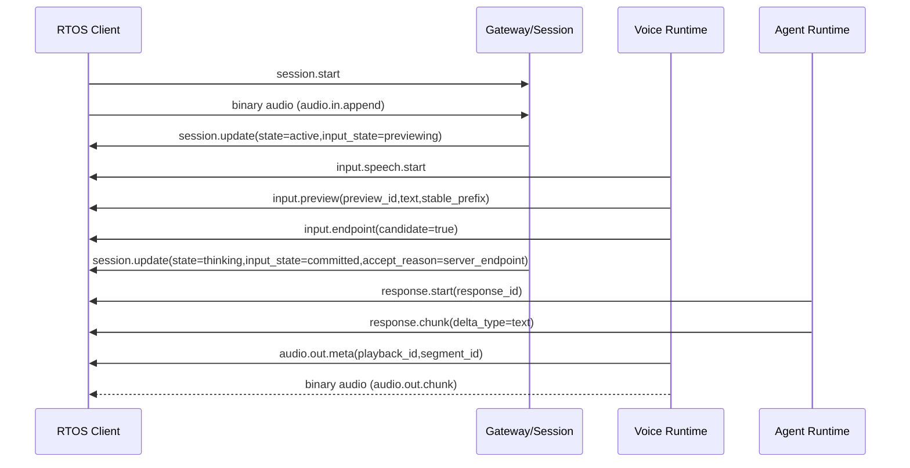
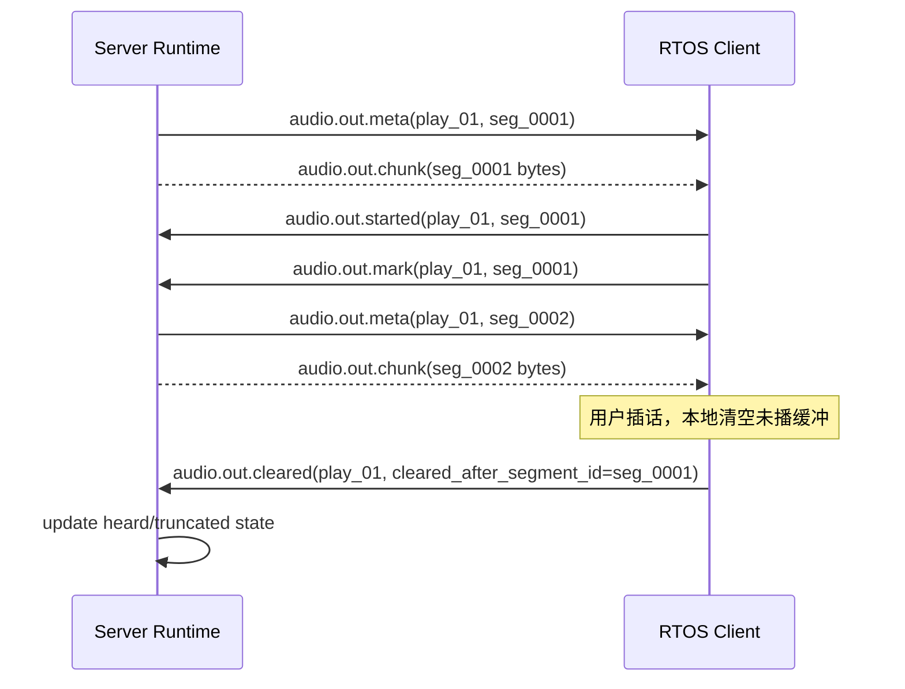
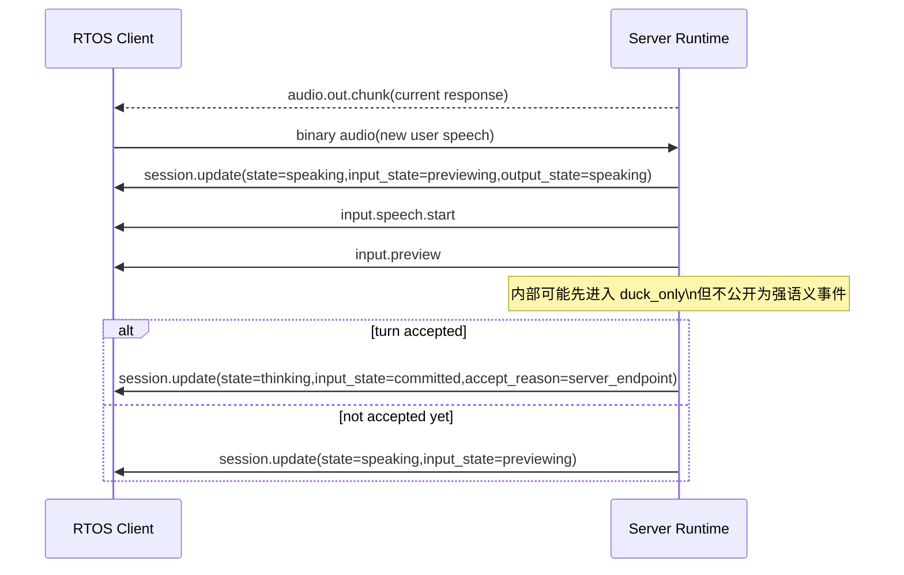
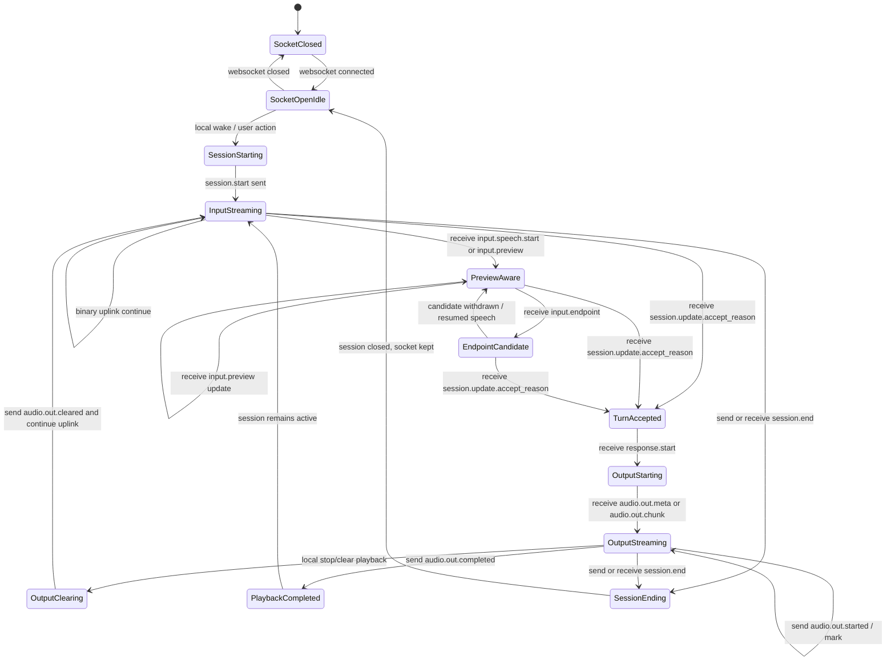

# Realtime 语音 client 协作协议方案 v0（2026-04-16）

## 文档性质

- 性质：协议协作方案 / 嵌入式 client 开发提案
- 状态：建议方案，供服务端与嵌入式同事并行开发对齐
- 兼容关系：在 `docs/protocols/realtime-session-v0.md` 与 `docs/protocols/rtos-device-ws-v0.md` 之上做 additive、capability-gated 扩展
- 配套 schema 草案：`schemas/realtime/voice-collaboration-v0-draft.schema.json`
- 配套实现指引：`docs/protocols/realtime-voice-client-implementation-guide-v0-zh-2026-04-16.md`
- 目标：让 RTOS / 嵌入式 client 能直接依据本文实现 preview 协作、accepted-turn 感知、playback truth 回传与本地状态机，而不把 client 做成第二编排层

## 一句话结论

当前最合适的协议演进方式，不是立刻推翻现有 `client_wakeup_client_commit` 基线，而是：

- 保留现有兼容基线不变
- 通过 discovery 能力协商逐步开放两类新协作能力：
  1. `preview-aware`：让 client 尽早看到 `speech start / preview partial / endpoint candidate`
  2. `playback-truth-aware`：让 client 把 `playback started / mark / cleared / completed` 回传给服务端

这样做的好处是：

- 老 client 无需立刻升级
- 新 client 可以提前并行开发
- 服务端 runtime 能先成熟，再把能力稳定公开
- RTOS client 只做“执行与回报事实”，不接管 turn / interruption 的主裁决

## 目录

1. 设计目标
2. 协议分层
3. 当前兼容基线
4. 建议新增的 capability-gated 能力
5. 发现与协商
6. 事件定义
7. Schema 草案映射
8. 时序图
9. RTOS client 状态机
10. 客户端实现要求
11. 服务端实现要求
12. 兼容与降级策略
13. 推荐开发顺序
14. 实现检查清单

## 1. 设计目标

本方案重点解决四类协作问题：

1. 端侧何时能看到 `preview / speech-start / endpoint-candidate`
2. 端侧如何知道服务端已经 accept 当前 turn
3. 端侧如何把 playback facts 回传给服务端
4. 在不引入第二编排层的前提下，端侧如何配合服务端完成更自然的 interruption / resume / heard-text

## 2. 协议分层

## 2.1 层次划分

### Layer A：兼容基线（必须支持）

- `session.start`
- `session.update`
- binary uplink -> `audio.in.append`
- `audio.in.commit`
- `response.start`
- `response.chunk`
- binary downlink -> `audio.out.chunk`
- `session.end`
- `error`

### Layer B：preview-aware 能力（建议支持）

- `input.speech.start`
- `input.preview`
- `input.endpoint`

### Layer C：playback-truth-aware 能力（建议支持）

- `audio.out.meta`
- `audio.out.started`
- `audio.out.mark`
- `audio.out.cleared`
- `audio.out.completed`

### Layer D：进阶协作字段（建议读取，可选使用）

- `session.update.payload.accept_reason`
- `session.update.payload.input_state`
- `session.update.payload.output_state`
- `response.start.payload.turn_id`
- `response.start.payload.trace_id`

## 2.2 设计原则

- 所有新增能力都必须 capability-gated
- 老 client 可以忽略未知事件和未知字段
- 新 client 不能因为服务端没开某能力就无法工作
- 端侧负责“执行与回报事实”，不负责“解释与裁决策略”
- preview 事件表达的是观察与候选，不是 turn accepted
- playback ack 表达的是事实，不是策略判断
- 当 `playback_ack` 已协商时，服务端可以据此延后 playback 收尾与 `state=active` 的回落时机，让 heard-text / interruption / resume 更接近端侧真实播放边界
- `audio.out.cleared` 尤其重要：它既是“后续内容未被播放”的事实，也可能成为服务端停止当前输出与写回 truncation 边界的依据

## 3. 当前兼容基线

## 3.1 当前必须支持的行为

### Client 必须

- 发起 `session.start`
- 连续上送音频 binary frame
- 在兼容路径下发送 `audio.in.commit`
- 接收 `session.update / response.start / response.chunk / audio.out.chunk / session.end / error`
- 播放服务端下发音频

### Server 必须

- 在兼容路径下仍支持 `audio.in.commit`
- 通过 `session.update` 报告 `state`
- 通过 `response.start` 与 `response.chunk` 推进响应
- 通过 binary frame 下发音频

## 3.2 当前已经可用、但 client 应按增强字段读取的内容

- `session.update.payload.input_state`
- `session.update.payload.output_state`
- `session.update.payload.turn_id`
- `session.update.payload.accept_reason`
- `response.start.payload.turn_id`
- `response.start.payload.trace_id`

这些字段不要求旧 client 处理，但新 client 应优先支持读取，因为它们已存在于当前兼容协议中，不属于后续新增事件。

## 3.3 accepted-turn 的唯一可靠公开信号

当前阶段，client 判断“一个 turn 已被服务端接受”的规则必须是：

- 以 `session.update.payload.accept_reason` 为主
- `turn_id` 单独出现，不构成 accepted-turn 证明
- `input_state=previewing` 也不构成 accepted-turn 证明
- `input.endpoint` 仅表示 endpoint candidate，不表示 accept 完成

## 4. 建议新增的 capability-gated 能力

## 4.1 Preview-aware

让 client 更早感知：

- 用户已经开始说话
- 服务端已有 preview partial
- 服务端认为本轮接近 endpoint

### 目标收益

- 更早显示“我在听 / 我开始懂了”
- 更自然的 UI / 灯效
- 更好调试 `server_endpoint` 主路径
- speaking 期间能更早进入本地轻反射（但不接管裁决）

## 4.2 Playback-truth-aware

让 client 把已播放事实回传给服务端。

### 目标收益

- 服务端不再把 generated 全文默认当作用户已听到
- interruption / resume 更自然
- heard-text persistence 更可信
- 以后要做 continue / continue-from-anchor 时有事实基础

## 5. 发现与协商

## 5.1 Discovery 响应建议新增结构

在 `GET /v1/realtime` 基础上，建议 additive 增加：

```json
{
  "voice_collaboration": {
    "preview_events": {
      "enabled": true,
      "speech_start": true,
      "partial": true,
      "endpoint_candidate": true,
      "mode": "preview_v1"
    },
    "playback_ack": {
      "enabled": true,
      "mode": "segment_mark_v1",
      "started": true,
      "mark": true,
      "cleared": true,
      "completed": true
    }
  }
}
```

### 字段解释

- `preview_events.enabled`: 服务端是否愿意发送 preview-aware 事件
- `preview_events.mode`: 当前 preview 事件版本
- `playback_ack.enabled`: 服务端是否接收 playback ack
- `playback_ack.mode`: 当前 playback ack 协作模式，推荐先从 `segment_mark_v1` 起步

## 5.2 `session.start` capability 建议

client 在 `session.start.payload.capabilities` 中建议新增：

```json
{
  "capabilities": {
    "half_duplex": true,
    "local_wake_word": true,
    "preview_events": true,
    "playback_ack": {
      "mode": "segment_mark_v1"
    }
  }
}
```

### 解释

- `preview_events=true`: client 愿意接收 preview 相关事件
- `playback_ack.mode=segment_mark_v1`: client 支持分段 mark ack

## 5.3 协商结果判定规则

client 端实现时应遵循：

- 先看 discovery 是否声明某能力 `enabled=true`
- 再看本端是否在 `session.start.capabilities` 中声明支持
- 二者都满足时，才进入相应协作模式
- 任一侧不支持，则自动回退到兼容基线

## 6. 事件定义

## 6.1 服务端 -> 客户端：`input.speech.start`（建议）

### 作用

- 表示服务端已确认本轮输入中出现 speech start
- 用于尽早给端侧 listening cue / duck cue / UI cue

### 方向

- server -> client

### 触发时机

- preview session 中首次观测到稳定 speech start

### 最小 payload

```json
{
  "type": "input.speech.start",
  "session_id": "sess_01",
  "seq": 11,
  "ts": "2026-04-16T10:00:00Z",
  "payload": {
    "preview_id": "prev_01",
    "audio_offset_ms": 120,
    "source": "server_preview"
  }
}
```

### Client 要求

- 可选地显示 listening / understanding cue
- 不要把它当成 turn accepted
- 不要据此自行结束当前播放或发起新 turn

### Server 要求

- 每个 `preview_id` 最多发送一次首次 speech start
- 若 client 未协商 `preview_events`，则不发送

## 6.2 服务端 -> 客户端：`input.preview`（建议）

### 作用

- 下发 preview partial / stable partial

### 最小 payload

```json
{
  "type": "input.preview",
  "session_id": "sess_01",
  "seq": 12,
  "ts": "2026-04-16T10:00:00Z",
  "payload": {
    "preview_id": "prev_01",
    "text": "明天周几",
    "stable_prefix": "明天周",
    "is_final": false,
    "stability": 0.74,
    "audio_offset_ms": 420
  }
}
```

### Client 要求

- 可显示为灰字 / 中间态字幕
- 后续同 `preview_id` 更新应覆盖旧 preview，而不是当成最终 transcript 累加
- 不能把它当成 authoritative final transcript
- 不能因为 `stable_prefix` 或 `stability` 较高，就把它本地提升为 accepted-turn

### Server 要求

- 同一 `preview_id` 持续更新
- `stable_prefix` 应尽量表示已收敛前缀
- `stability` 应仅作为观察性提示，不应替代 accepted-turn 语义
- 服务端可在内部利用同一稳定前缀信号做 prewarm，但这仍不改变公开协议上“preview 只是观察事件”的结论
- 若未协商 `preview_events` 则不发送

## 6.3 服务端 -> 客户端：`input.endpoint`（建议）

### 作用

- 表示服务端认为当前输入已出现 endpoint candidate
- 这是“接近接受”的信号，不等于已 accepted turn

### 最小 payload

```json
{
  "type": "input.endpoint",
  "session_id": "sess_01",
  "seq": 13,
  "ts": "2026-04-16T10:00:01Z",
  "payload": {
    "preview_id": "prev_01",
    "candidate": true,
    "reason": "semantic_pause_complete",
    "audio_offset_ms": 980
  }
}
```

### Client 要求

- 可用于 UI 呈现“即将收口”
- 不要把它当成 commit 完成
- 不要自行开始下一状态机

### Server 要求

- 同一个 candidate 可被撤销；若 later resumed，不应误导 client 认为 turn 已接受

## 6.4 服务端 -> 客户端：现有 `session.update` 的使用要求（必须）

### 关键字段

```json
{
  "state": "thinking",
  "input_state": "committed",
  "output_state": "thinking",
  "turn_id": "turn_01",
  "accept_reason": "server_endpoint"
}
```

### Client 解释规则

- `accept_reason` 存在时，才可认为当前输入已被 accept
- `input_state=previewing` 不等于 accepted
- `turn_id` 单独出现不代表 turn accepted
- `state` 仍是兼容顶层字段

## 6.5 服务端 -> 客户端：`audio.out.meta`（建议）

### 作用

- 在一段 audio segment / clause 下发前，声明其 playback 元信息
- 供 client 后续回传 `started / mark / cleared / completed`

### 最小 payload

```json
{
  "type": "audio.out.meta",
  "session_id": "sess_01",
  "seq": 21,
  "ts": "2026-04-16T10:00:01Z",
  "payload": {
    "response_id": "resp_01",
    "playback_id": "play_01",
    "segment_id": "seg_0001",
    "text": "明天是周四。",
    "expected_duration_ms": 860,
    "is_last_segment": false
  }
}
```

### Client 要求

- 收到 `audio.out.meta` 后，为后续 binary audio chunk 建立当前 segment 上下文
- 至少支持记住 `playback_id + segment_id`
- 即使不支持 playback ack，也可忽略该事件继续播放

### Server 要求

- `audio.out.meta` 应先于对应 segment 的音频 binary frame 下发
- 一段 segment 应有稳定 `segment_id`
- 若未协商 `playback_ack`，可不发送

## 6.6 客户端 -> 服务端：`audio.out.started`（建议）

### 作用

- 告诉服务端：本地已经实际开始播放某个 playback / segment

### 最小 payload

```json
{
  "type": "audio.out.started",
  "session_id": "sess_01",
  "seq": 52,
  "ts": "2026-04-16T10:00:01Z",
  "payload": {
    "response_id": "resp_01",
    "playback_id": "play_01",
    "segment_id": "seg_0001"
  }
}
```

### Client 要求

- 在真正开始扬声器播放时发送，而不是在收到音频时立即发送
- 一个 segment 最多发一次 started

### Server 要求

- 更新 playback truth 链中的 started 状态
- 不据此直接修改 turn 语义，只更新事实层

## 6.7 客户端 -> 服务端：`audio.out.mark`（建议，核心）

### 作用

- 告诉服务端：某个 segment 已完整播放完成

### 最小 payload

```json
{
  "type": "audio.out.mark",
  "session_id": "sess_01",
  "seq": 53,
  "ts": "2026-04-16T10:00:02Z",
  "payload": {
    "response_id": "resp_01",
    "playback_id": "play_01",
    "segment_id": "seg_0001",
    "played_duration_ms": 860
  }
}
```

### Client 要求

- segment 真正播完再发
- 若 segment 被 clear 了，不应再补发 mark

### Server 要求

- 将该 segment 计入 heard-text 已播部分
- 为 interruption / resume / memory 写回提供依据

## 6.8 客户端 -> 服务端：`audio.out.cleared`（建议，核心）

### 作用

- 告诉服务端：本地缓冲已被清空，某些 segment 不会继续播放

### 最小 payload

```json
{
  "type": "audio.out.cleared",
  "session_id": "sess_01",
  "seq": 54,
  "ts": "2026-04-16T10:00:02Z",
  "payload": {
    "response_id": "resp_01",
    "playback_id": "play_01",
    "cleared_after_segment_id": "seg_0001",
    "reason": "user_barge_in"
  }
}
```

### Client 要求

- 在本地 stop / clear 缓冲后尽快发送
- 若不知道精确 segment 内 cursor，至少要报告“从哪个 segment 之后被清掉”

### Server 要求

- 将后续未 mark 的 segment 标记为未被 heard
- 更新 truncated / interrupted 状态

## 6.9 客户端 -> 服务端：`audio.out.completed`（建议）

### 作用

- 表示整个 playback 已自然播放结束

### 最小 payload

```json
{
  "type": "audio.out.completed",
  "session_id": "sess_01",
  "seq": 55,
  "ts": "2026-04-16T10:00:03Z",
  "payload": {
    "response_id": "resp_01",
    "playback_id": "play_01"
  }
}
```

### Client 要求

- 仅在本轮 response 的全部 segment 均已播放完时发送

### Server 要求

- 更新 `playback_completed`
- 允许更自然地返回 `active` 或收口 session

## 6.10 `duck_only / backchannel` 的协议边界

### 结论

当前不建议为 `duck_only / backchannel` 单独发公开强语义事件，让 client 自己做主裁决。

更合适的边界是：

- 服务端内部决定 `ignore / backchannel / duck_only / hard_interrupt`
- client 只做：
  - 本地快速 duck / unduck 执行（如果设备端保留该能力）
  - `playback_started / mark / cleared / completed` 事实回传

### 原因

- 避免 adapter / client 变成第二编排层
- 避免端侧与服务侧对 interruption policy 理解分裂
- 先让端侧回传事实，再让服务端解释事实

## 7. Schema 草案映射

## 7.1 说明

正式稳定 schema 仍是：

- `schemas/realtime/session-envelope.schema.json`

本提案新增一份草案 schema：

- `schemas/realtime/voice-collaboration-v0-draft.schema.json`

它的定位是：

- 补充 discovery / capability / 新事件 payload 的实现草案
- 不代表当前稳定公开合同已经整体升级

## 7.2 草案 schema 覆盖内容

草案 schema 至少覆盖：

- discovery 中 `voice_collaboration` 结构
- `session.start.payload.capabilities.preview_events`
- `session.start.payload.capabilities.playback_ack`
- 新增事件：
  - `input.speech.start`
  - `input.preview`
  - `input.endpoint`
  - `audio.out.meta`
  - `audio.out.started`
  - `audio.out.mark`
  - `audio.out.cleared`
  - `audio.out.completed`

## 7.3 事件到 schema 节点的对照

| 事件 / 结构 | schema 节点 |
| --- | --- |
| discovery.voice_collaboration | `#/definitions/discoveryVoiceCollaboration` |
| session.start.capabilities.preview_events | `#/definitions/sessionStartPreviewCapability` |
| session.start.capabilities.playback_ack | `#/definitions/sessionStartPlaybackAckCapability` |
| input.speech.start | `#/definitions/inputSpeechStartEnvelope` |
| input.preview | `#/definitions/inputPreviewEnvelope` |
| input.endpoint | `#/definitions/inputEndpointEnvelope` |
| audio.out.meta | `#/definitions/audioOutMetaEnvelope` |
| audio.out.started | `#/definitions/audioOutStartedEnvelope` |
| audio.out.mark | `#/definitions/audioOutMarkEnvelope` |
| audio.out.cleared | `#/definitions/audioOutClearedEnvelope` |
| audio.out.completed | `#/definitions/audioOutCompletedEnvelope` |

## 8. 时序图

## 8.1 短命令：preview -> endpoint -> accepted turn -> first segment



## 8.2 playback truth：segment played / clear / complete



## 8.3 speaking 中插话：preview 与 accept 的边界



## 9. RTOS client 状态机

## 9.1 设计原则

RTOS client 状态机应该表达：

- 连接与会话生命周期
- 本地采音 / 播放 / preview-aware / playback-ack 执行状态
- 但不表达 server 内部 turn 裁决逻辑

也就是说，client 状态机不能尝试用本地状态复刻 `duck_only / hard_interrupt / endpoint accept` 的服务端判断。

## 9.2 推荐状态机



## 9.3 状态解释

### `SocketOpenIdle`

- WebSocket 已连通
- 尚未进入活跃会话
- 不上传音频

### `SessionStarting`

- 本地 wake 或用户动作已触发
- 正在发送 `session.start`

### `InputStreaming`

- 正常采音并上送 binary audio
- 在兼容基线下，本地仍可能最终发送 `audio.in.commit`

### `PreviewAware`

- 已收到 `input.speech.start` 或 `input.preview`
- 可更新 UI / 灯效 / 调试字幕
- 但仍不得认定 turn 已被 accept

### `EndpointCandidate`

- 已收到 `input.endpoint`
- 表示服务端认为“接近 accept”
- 仍不是 accepted turn

### `TurnAccepted`

- 只有收到 `session.update.payload.accept_reason` 才进入
- 这是 client 观察到的“服务端已 accept 当前输入”

### `OutputStarting`

- 已收到 `response.start`
- 可能即将收到文本 delta 或音频 meta / chunk

### `OutputStreaming`

- 正在播放服务端输出
- 若已协商 `playback_ack`，应回传 `audio.out.started / mark`

### `OutputClearing`

- 本地 stop / clear playback 后的过渡态
- 必须尽快发 `audio.out.cleared`
- 之后通常回到 `InputStreaming` 继续采集新输入

### `PlaybackCompleted`

- 当前 playback 自然结束
- 若已协商 `playback_ack`，应发 `audio.out.completed`

## 9.4 状态转移硬规则

### Rule A：preview 不是 accepted

- `input.speech.start`
- `input.preview`
- `input.endpoint`

都不能驱动 client 进入 `TurnAccepted`。

### Rule B：accept_reason 才是 accepted-turn 主信号

只要：

- `session.update.payload.accept_reason` 存在

client 才能进入 `TurnAccepted`。

### Rule C：playback ack 只在实际播放层触发

- `audio.out.started` 在真正开始播时发送
- `audio.out.mark` 在 segment 真播完时发送
- `audio.out.cleared` 在本地 clear 后立即发送
- `audio.out.completed` 在整轮播放自然结束后发送

### Rule D：client 不推断 duck_only / hard_interrupt

client 只做：

- 停 / 清 / 播 / 回报事实

不根据局部现象自行声明：

- 这是 `duck_only`
- 这是 `hard_interrupt`

这些都属于服务端 runtime 解释层。

## 10. 客户端实现要求

## 10.1 必须

- 支持当前兼容基线完整闭环
- 忽略未知事件和未知字段
- 将 `state` 继续当作兼容顶层状态
- 把 `accept_reason` 作为 accepted-turn 的唯一主判断信号

## 10.2 建议

- 支持 `input_state / output_state / accept_reason`
- 支持 `preview_events`
- 支持 `audio.out.meta + started / mark / cleared / completed`
- 本地 playback 层保留 `stop / clear` 能力
- 为 preview 和 playback ack 维持轻量状态缓存：
  - `preview_id`
  - `response_id`
  - `playback_id`
  - `segment_id`

## 10.3 可选

- 根据 `input.speech.start` 做 UI / 灯效
- 在 debug 页面或工程版固件里显示 preview partial
- 上报更细 playhead（后续版本）

## 11. 服务端实现要求

## 11.1 必须

- 保留兼容基线
- discovery 清楚区分 baseline 与 capability-gated 能力
- 新事件不开启时不得影响老 client

## 11.2 建议

- `accept_reason`、`input_state`、`output_state` 始终保持语义一致
- preview 事件只表达观察与候选，不替代 accepted-turn 语义
- playback facts 只当事实输入，不把 client 变成主裁判
- `audio.out.meta` 中的 `segment_id` 在一轮 response 内必须稳定且唯一

## 12. 兼容与降级策略

## 12.1 旧 client

若旧 client：

- 不声明 `preview_events`
- 不声明 `playback_ack`

则服务端行为：

- 仍走当前兼容基线
- 不发送新增 preview / playback 协作事件
- playback truth 回退到 heuristic 模式

## 12.2 新 client 但服务端未开能力

client 必须：

- 检查 discovery 与 `session.start` 协商结果
- 能力未开时自动回退兼容路径

## 12.3 部分能力协商成功

允许以下组合：

- 仅 `preview-aware`
- 仅 `playback-truth-aware`
- `preview-aware + playback-truth-aware`

## 13. 推荐开发顺序

### 第一步：兼容增强读取

先支持：

- 现有兼容基线
- `input_state / output_state / accept_reason` 的读取
- `response.start.turn_id / trace_id` 的读取

### 第二步：preview-aware

支持：

- `input.speech.start`
- `input.preview`
- `input.endpoint`

### 第三步：playback-truth-aware

支持：

- `audio.out.meta`
- `audio.out.started`
- `audio.out.mark`
- `audio.out.cleared`
- `audio.out.completed`

## 14. 实现检查清单

### 14.1 discovery / capability

- [ ] 读取 `voice_collaboration.preview_events`
- [ ] 读取 `voice_collaboration.playback_ack`
- [ ] 在 `session.start.capabilities` 中声明本端支持能力

### 14.2 accepted-turn

- [ ] 用 `accept_reason` 判断 accepted turn
- [ ] 不把 preview 事件误判成 accepted turn

### 14.3 playback truth

- [ ] 为 `playback_id + segment_id` 建立本地映射
- [ ] `started / mark / cleared / completed` 时机正确
- [ ] clear 后不再错误补发 mark

### 14.4 兼容性

- [ ] 未协商能力时，自动回落兼容基线
- [ ] 未识别事件直接忽略，不导致断链

## 附：事件清单总表

| 事件 | 方向 | 层级 | 必须性 |
| --- | --- | --- | --- |
| `session.start` | C -> S | baseline | 必须 |
| `session.update` | 双向 | baseline | 必须 |
| `audio.in.commit` | C -> S | baseline | 必须 |
| `response.start` | S -> C | baseline | 必须 |
| `response.chunk` | S -> C | baseline | 必须 |
| `input.speech.start` | S -> C | preview-aware | 建议 |
| `input.preview` | S -> C | preview-aware | 建议 |
| `input.endpoint` | S -> C | preview-aware | 建议 |
| `audio.out.meta` | S -> C | playback-truth-aware | 建议 |
| `audio.out.started` | C -> S | playback-truth-aware | 建议 |
| `audio.out.mark` | C -> S | playback-truth-aware | 建议 |
| `audio.out.cleared` | C -> S | playback-truth-aware | 建议 |
| `audio.out.completed` | C -> S | playback-truth-aware | 建议 |

## 相关文档

- `docs/architecture/voice-architecture-blueprint-zh-2026-04-16.md`
- `docs/architecture/voice-architecture-execution-roadmap-zh-2026-04-16.md`
- `docs/protocols/realtime-session-v0.md`
- `docs/protocols/rtos-device-ws-v0.md`
- `schemas/realtime/session-envelope.schema.json`
- `schemas/realtime/voice-collaboration-v0-draft.schema.json`
